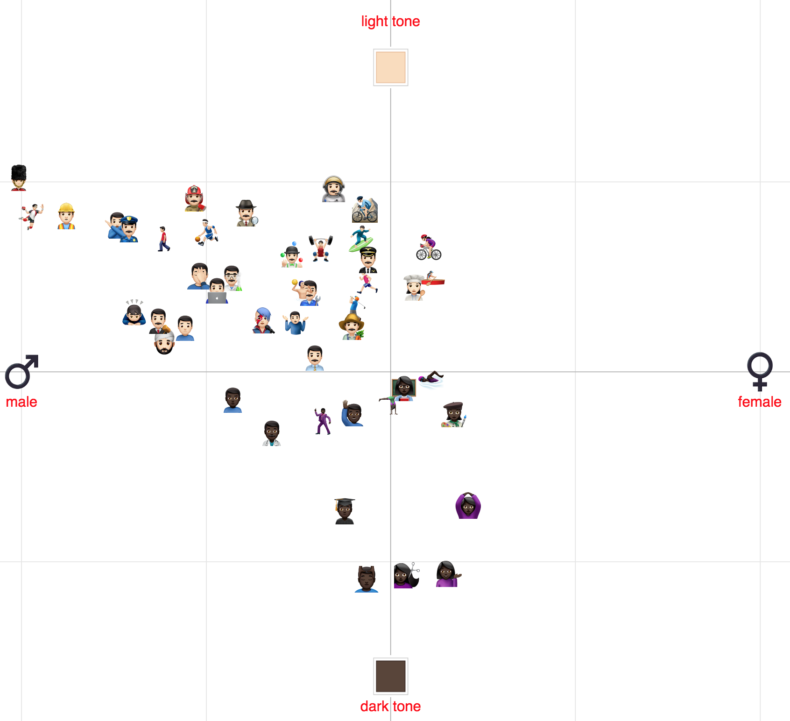
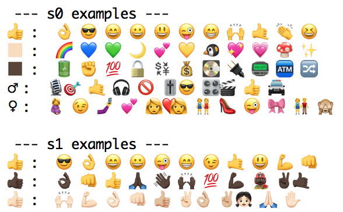

## How Gender and Skin Tone Modifiers Affect Emoji Semantics in Twitter 
#### Francesco Barbieri and Jose Camacho Collados

The following repository includes the code and pre-trained embeddings from the paper *[How Gender and Skin Tone Modifiers Affect Emoji Semantics in Twitter](http://aclweb.org/anthology/S18-2011)*  (*SEM 2018).



### Use our embeddings

We release the two sets of 100-dimensional SW2V embeddings trained on Twitter (USA-based, English):

1. Word, base emoji and modifier embeddings.
 The vocabulary includes words (e.g. *house*, *car*, ...), base emojis (without sex or skin tone modifiers, e.g. 👍), and modifiers (e.g. male/female, or light/dark skin tone). Download embeddings [here](https://drive.google.com/open?id=1xcxfMyewMFgWjVg_UqtIBz273z0jq4x-) [~300 MB]

2. Word and emoji (base and modified) embeddings.
The vocabulary includes words (e.g. *house*, *car*, ...) and emojis, both base (without sex or skin tone modifiers, e.g. 👍), and with modifiers (e.g.  👍🏻,👍🏽,👍🏿). Download embeddings [here](https://drive.google.com/open?id=1UuO9EKrJGElAjrjSJ4PspQZ4dNLGo3ya) [~300 MB]

Notes:
- All words are lowercased.
- For obtaining the original emoji and modifier encoding from the embeddings, you can use the following [mapping](mapping.tsv) (tab separated: frequency ranking, emoji, cldr, emoji code with modifiers, emoji code without modifiers).

When you run example.py (with python3) the output should be the following:



### Train New Embeddings

We used the original SW2V code for training the embeddings: http://lcl.uniroma1.it/sw2v/ . We ran the code from the terminal as follows (these are the same parameters used in our experiments):

1. Word, base emoji and modifier embeddings: 
```bash
TH=1 #threads
INPUT="tweets.txt"
OUTPUT="word_emoji_embedding_s0.bin"
sw2v -train $INPUT -output $OUTPUT -cbow 1 -size 100 -window 6 -negative 0 -hs 1 -threads $TH -binary 1 -iter 5 -update 0 -senses 0 -synsets_input 1 -synsets_target 1
```

2. Word and emoji (base and modified) embeddings:
```bash
TH=1 #threads
INPUT="tweets.txt"
OUTPUT="word_emoji_embedding_s1.bin"
sw2v -train $INPUT -output $OUTPUT -cbow 1 -size 100 -window 6 -negative 0 -hs 1 -threads $TH -binary 1 -iter 5 -update 0 -senses 1 -synsets_input 1 -synsets_target 1
```

The provided models are freely available under [Creative Commons CC BY 3.0](https://creativecommons.org/licenses/by/3.0/), using the reference below for attribution:
```bash
@InProceedings{barbieri:sem2018,
  author = 	"Barbieri, Francesco
		and Camacho-Collados, Jose",
  title = 	"How Gender and Skin Tone Modifiers Affect Emoji Semantics in Twitter",
  booktitle = 	"Proceedings of the Seventh Joint Conference on Lexical and Computational Semantics",
  year = 	"2018",
  publisher = 	"Association for Computational Linguistics",
  pages = 	"101--106",
  location = 	"New Orleans, Louisiana",
  url = 	"http://aclweb.org/anthology/S18-2011"
}

```
